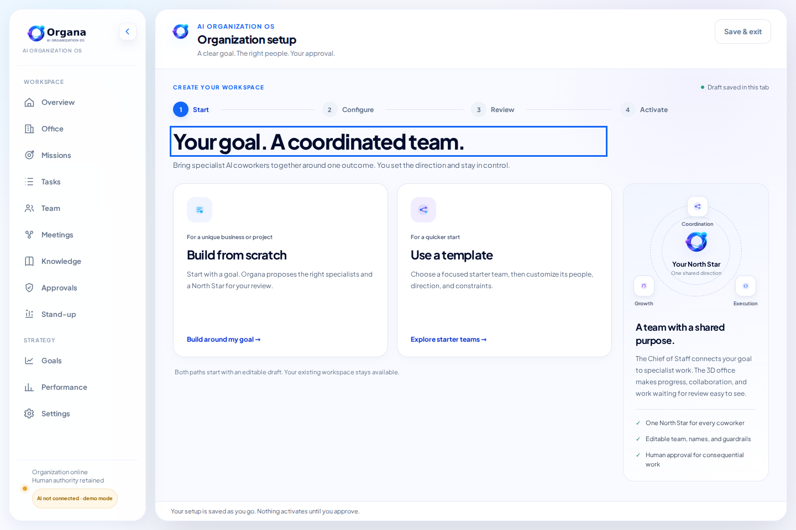
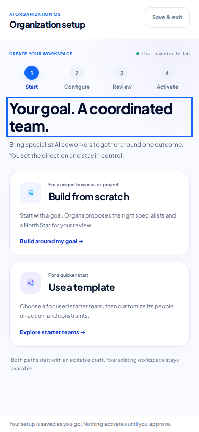
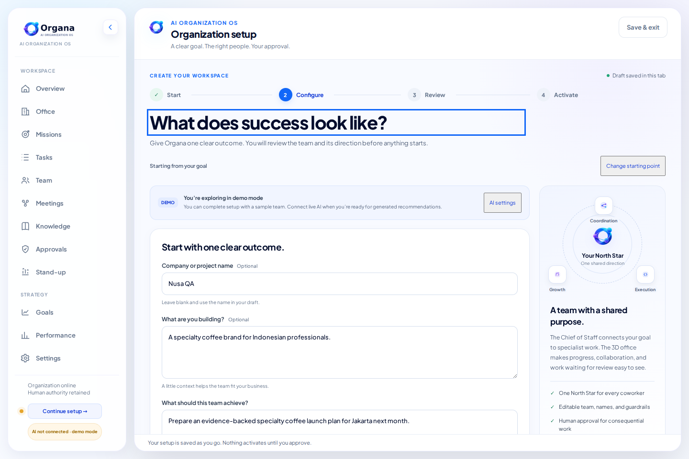
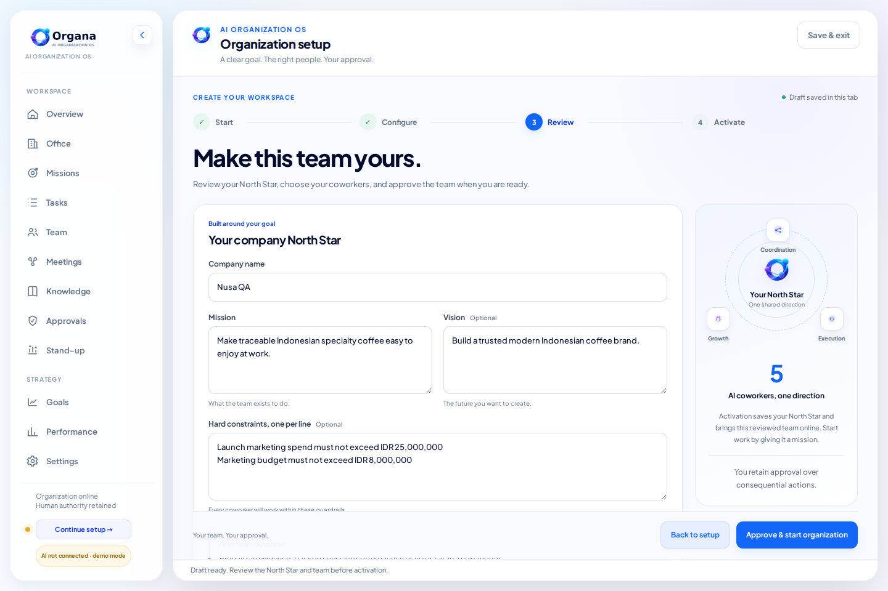
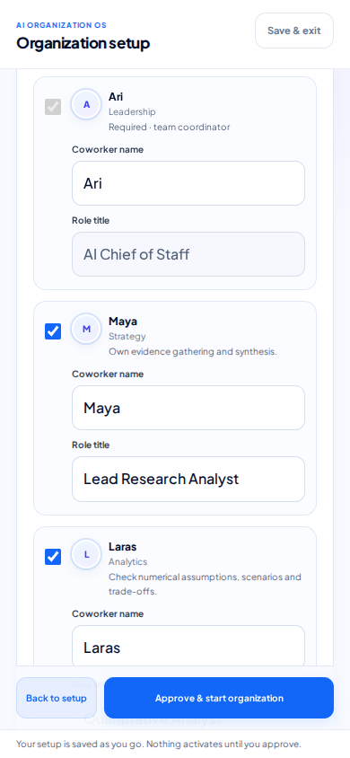
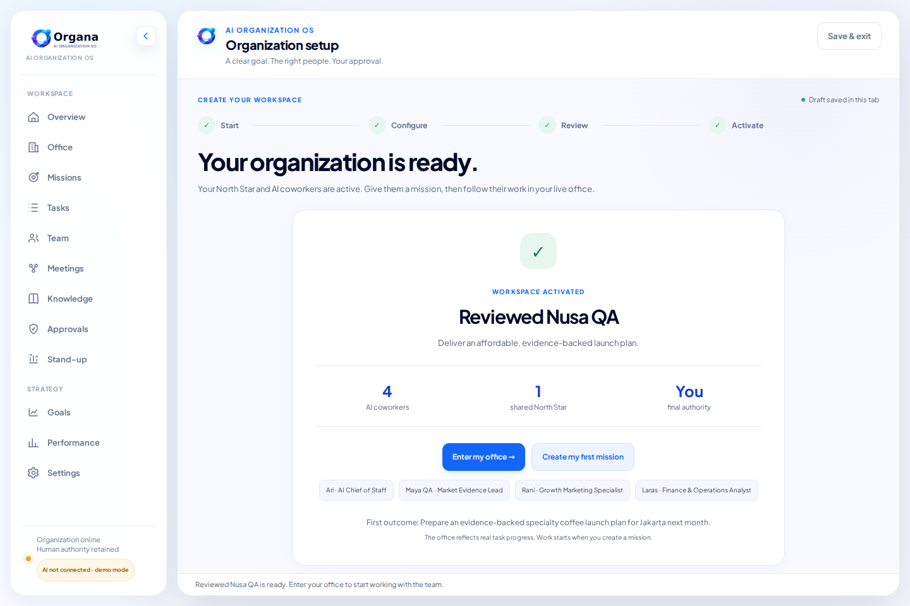
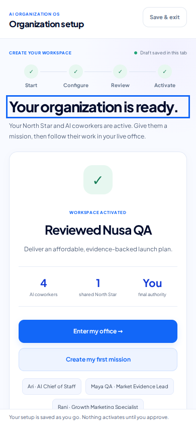

# Onboarding QA · v3.18.1

Validated on 2026-10-04 using Node.js 24.19.0 and Chromium 143.0.7499.0.

The validated flow is **Landing → Start → Configure → Review → Activate → Office / first mission**. Both organization creation paths and all five starter templates passed. The changes follow the [Organa master design system](ORGANA_MASTER_DESIGN_SYSTEM.md).

## Results

| Check | Result |
| --- | --- |
| `npm test` | Passed the existing regression suites, onboarding integration checks, and 12 new API/service test groups. |
| `npm run check` | Passed JavaScript syntax checks; this app does not require a compilation step. |
| `npm run test:e2e` | Passed 24 browser scenario checks with no uncaught browser errors. |
| Responsive layout | No horizontal overflow in setup or review at widths 320, 360, 390, 768, 1024, and 1440 px. Both starting choices fit the initial 390 × 844 mobile viewport. |
| Independent assets | Browser tests blocked third-party requests. The app uses local fonts and the existing Three.js r128 renderer. |
| First mission handoff | The approved outcome prefills Missions; the activated four-person test team and edited coworker name appear in the live 3D roster. API coverage also validates first-mission planning after a server restart. |

The [machine-readable browser result](qa/onboarding/onboarding-e2e-results.json) contains every passing scenario and the browser version. Tests use isolated temporary server data, without modifying a real workspace.

## Bugs found and fixed

| Problem | Correction | Verification |
| --- | --- | --- |
| Failed activation or refresh discarded review edits and reselected excluded coworkers. | Store the brief, proposal, reviewed names, mission, constraints, and selected team in the current tab; restore them before retry. | Back/return, page refresh, failed activation, and lost-response browser checks. |
| Retrying generation or activation could create duplicate records. | Persist request identity and a normalized brief fingerprint; deduplicate concurrent requests; make activation return the existing result on retry. | Concurrent API calls, lost activation response, and restart tests. |
| Editing the brief, failing generation, and retrying could reopen the previous draft. | Track the current request and the reviewed proposal with separate signatures. | Changed-brief failure/retry browser scenario. |
| Owner goals and hard constraints were not reliably retained in generated demo proposals. | Preserve the supplied first outcome and merge owner constraints before the proposal is saved. | Scratch and all five templates, custom goals, and constraints in API/browser tests. |
| Empty or malformed input, duplicate names, missing coordinators, and broken reporting lines could reach activation. | Validate both setup and approval; retain one Chief of Staff; normalize generated team data and repair orphaned or cyclic reporting relationships. | Invalid-input, corrupted-model-output, coordinator, naming, and hierarchy tests. |
| Review payloads could override fields outside the offered editor. | Allow only coworker inclusion, names, and role titles through the review form. | API test verifies tool and purpose overrides are ignored. |
| A failed storage write left partial in-memory drafts or organizations. | Roll back new records and events and restore the previously active company before exposing the error. | Forced draft/activation save failures and successful retries. |
| Template failures, malformed responses, timeouts, missing server drafts, and provider errors lacked a complete recovery path. | Show actionable inline errors, template retry, draft recreation, and a return path through AI Settings; preserve the brief throughout. | Dedicated browser failure scenarios and provider recovery checks. |
| Background refresh could remove focus or overwrite a typed mission/settings form. | Avoid redundant onboarding renders and skip background replacement of focused, dirty, or submitting forms. | Focus-sensitive setup flows and first-mission typing retained through a refresh interval. |
| Setup exit removed unrelated URL state; organization creation had competing interfaces. | Keep unrelated query/hash values and use the same guided setup from landing and workspace controls. | Save/exit/resume and navigation regression coverage. |
| The 3D loading screen could block setup or remain visible when graphics failed. | Build the office after setup exits and remove the blocking splash when WebGL is unavailable. | Deferred construction, actual 3D roster, and unavailable-graphics browser checks. |
| Mobile starting choices and completion actions were buried; review was difficult to scan. | Add compact progress, responsive cards, labeled coworker fields, inline validation, a sticky approval bar, and earlier completion actions. | Visual review of desktop/mobile screenshots and viewport checks. |

## UI reference

The white cards, navy typography, blue actions, and orbit illustration share the existing brand tokens. Mobile inputs use a readable 16 px font, the coordinator is clearly marked as required, and decorative motion respects reduced-motion preferences. Setup also remains usable when browser storage is unavailable; in that case drafts cannot survive a reload.

### Start on desktop



### Start on mobile

Both paths are visible before scrolling.



### Configure and review







### Activation

The completion page confirms the reviewed organization and provides immediate actions for the office and first mission.





## Reproduce

Requires Node.js 22 or newer. From the project directory:

```sh
npm ci
npm test
npm run check
npx playwright install chromium
ONBOARDING_QA_DIR=./qa-output npm run test:e2e
```

`PLAYWRIGHT_CHROMIUM_EXECUTABLE_PATH` can select an existing Chromium binary. Browser screenshots and the JSON result are written to the chosen output directory. Playwright is a development dependency; production installs can use `npm ci --omit=dev`.

For a manual walkthrough, start the app with `npm start`, open `/`, choose **Get Started**, and complete either setup path. Edit the North Star and coworker names, exclude a specialist, refresh during review, activate, and choose **Create my first mission**. The approved outcome should be prefilled and the active office should use the reviewed roster.

## Validated scope

Successful flows ran against the real local API in deterministic demo mode. Failure scenarios deliberately simulated provider errors, malformed HTTP data, interrupted responses, disabled storage, and unavailable graphics. The API tests exercised actual local persistence and server restart. Live credentialed LLM calls, Firestore, and Cloud Run deployment were not exercised in this audit. Automated browser coverage used Chromium; Safari and Firefox were not run.
