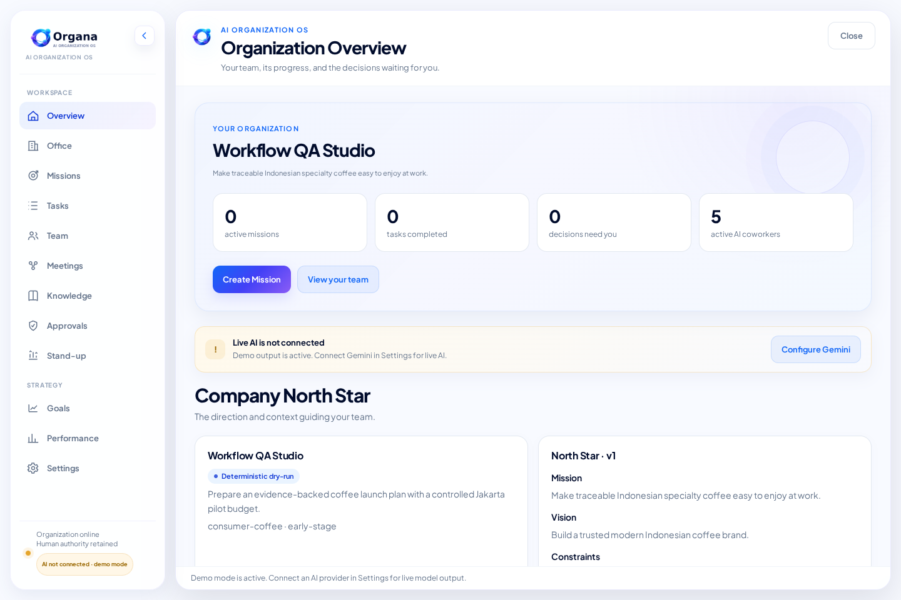
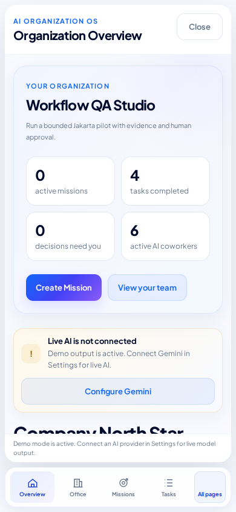
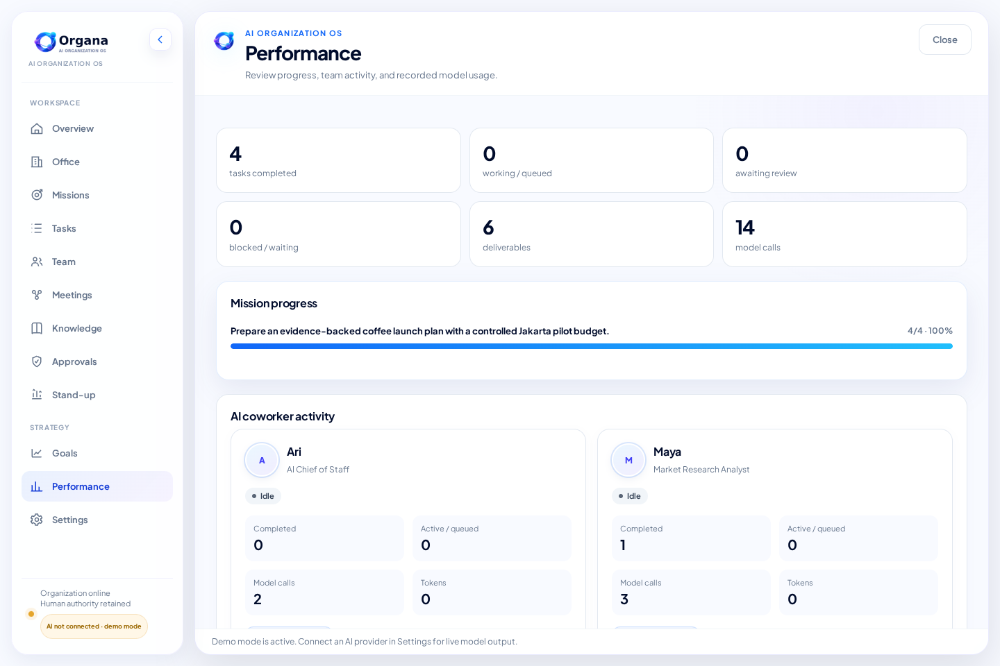
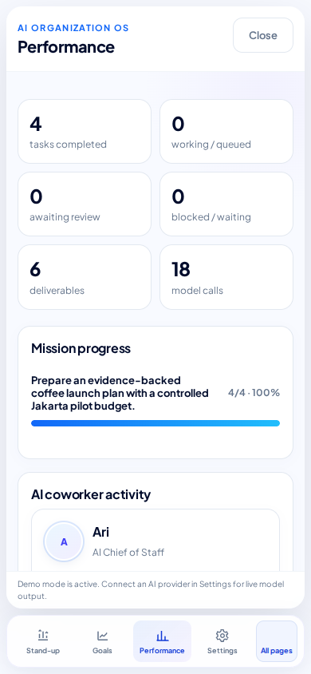
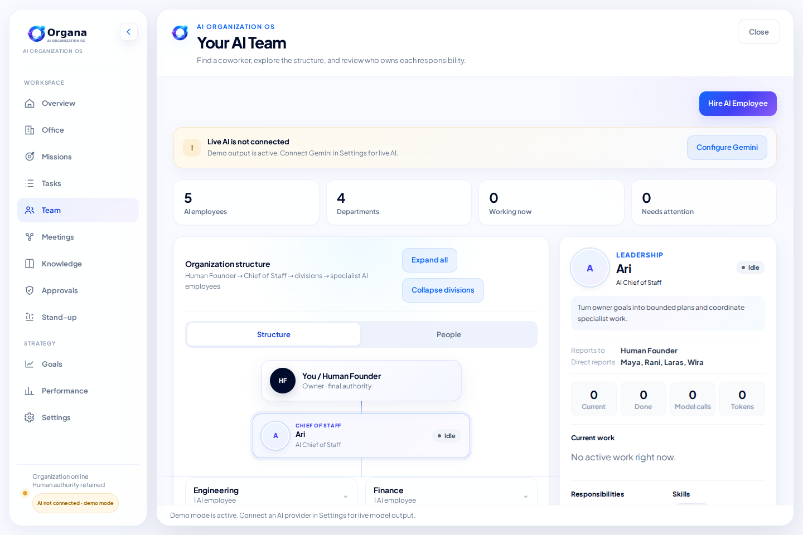
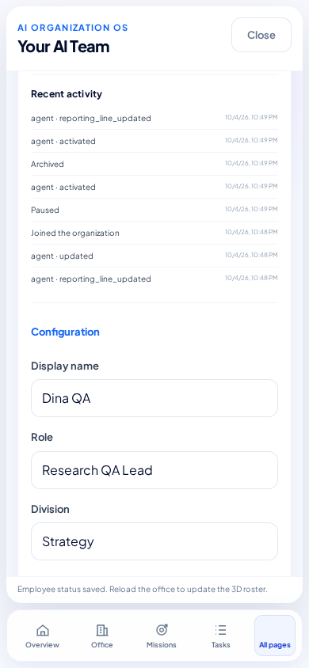
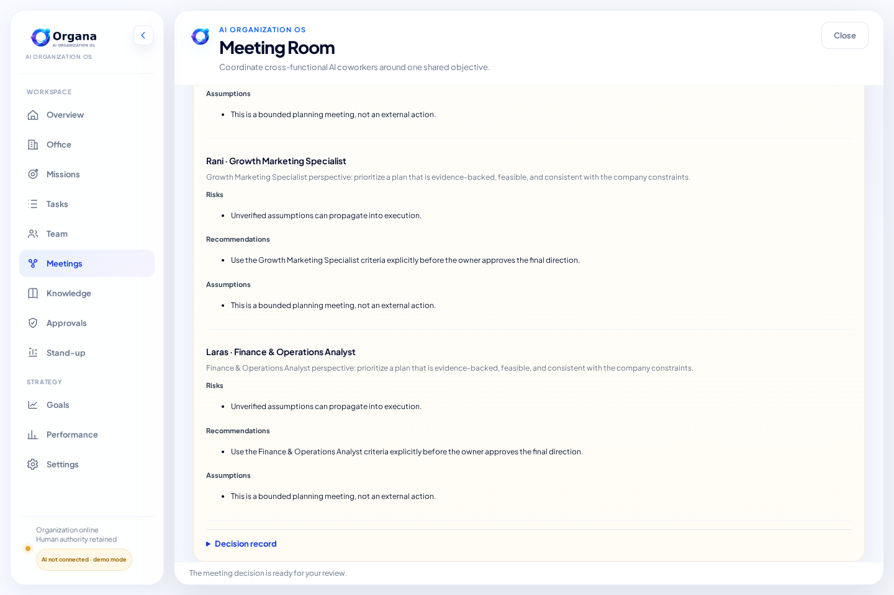
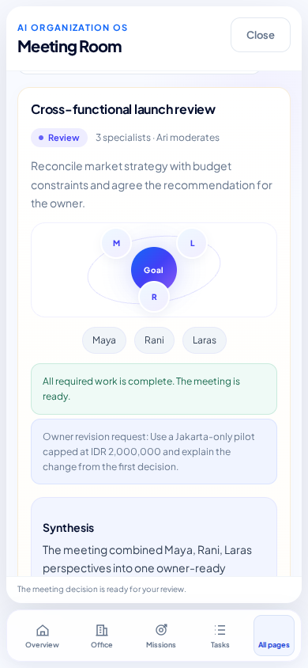
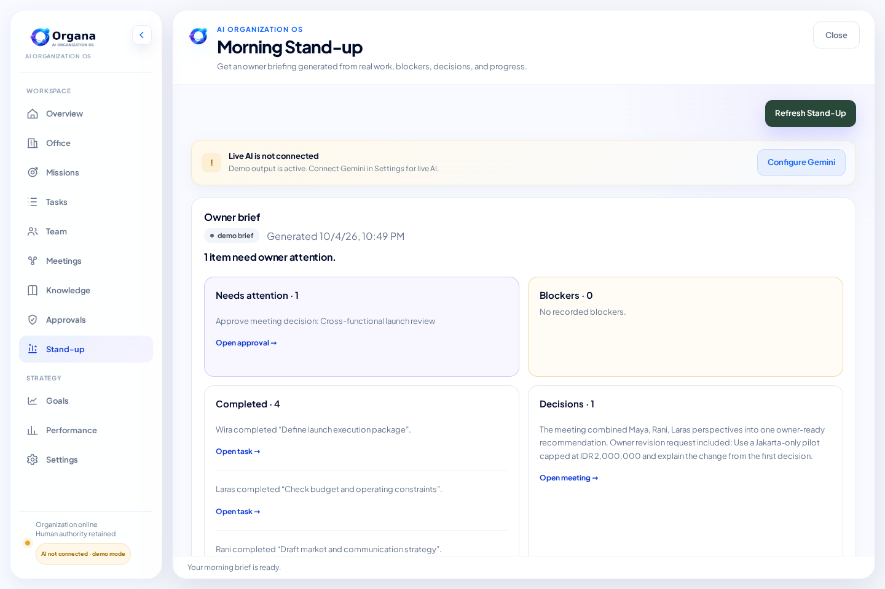
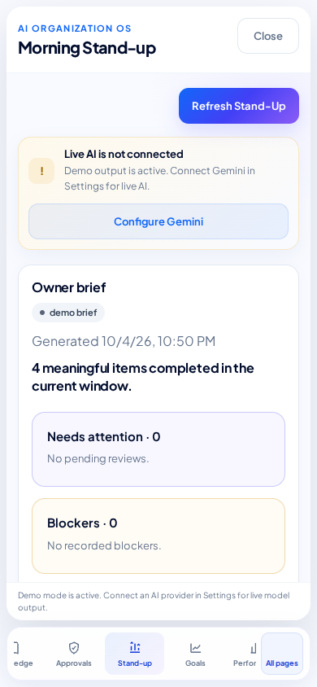

# Workspace, Team, Meeting, and Stand-up QA · v3.18.2

Audit date: 2026-10-04. Runtime: Node.js 24.19.0; browser: Chromium 143.0.7499.0.

The tested owner journey starts with organization setup and continues through **Overview → Team → draft employee → reviewed hiring → North Star → mission → task review → meeting → revision → evaluation → decision approval → stand-up**. Evaluation is available in the existing **Performance** section. Browser checks use real local API calls and persisted server state; failure cases deliberately interrupt selected responses.

## Verification

| Check | Coverage |
| --- | --- |
| `npm test` | Existing regression suites, 12 onboarding API/service groups, and 15 additional workflow API/service groups. |
| `npm run check` | Syntax validation for application code, team validation, meeting/stand-up services, prompts, and events. |
| `npm run test:e2e:workflows` | 30 browser scenario checks covering Overview, evaluation, single navigation, team setup/lifecycle, North Star drafts, meeting review/revision, stand-up, failures, and responsive layout. |
| `npm run test:e2e` | The 24 existing onboarding browser checks rerun for shared UI regression coverage. |
| Responsive layouts | All ten workspace sections inspected at widths 320, 390, 768, 1024, and 1440 px; no horizontal content overflow. |
| Popup navigation | No sidebar or navigation menu inside workspace and task popups. The single main app navigation stays usable, including on mobile and with a saved collapsed-sidebar preference. |
| Offline app resources | Third-party browser requests blocked; the app uses its locally bundled fonts and renderer. |

The final browser results are recorded in [workflows-e2e-results.json](qa/workflows/workflows-e2e-results.json). The screenshots below show the actual app after the fixes.

## Fixes and evidence

| Finding | Change | Check |
| --- | --- | --- |
| Workspace popups repeated the main sidebar and made the outer navigation unavailable. | Remove the internal menu from markup and route all controls through one workspace router. Open the workspace beside the main navigation. | All ten sections on desktop and mobile; task result popup; keyboard close; static navigation regression. |
| Slow Overview responses could replace a newer navigation; loading errors had no immediate retry. | Ignore stale navigation completions and offer an inline view-loading retry. | Delayed Overview followed by Team; failed Overview request and retry. |
| North Star activation errors were uncaught and draft review could disappear on background refresh. | Validate the mission, preserve failed edits and reviewed drafts, prevent repeat submits, and catch activation errors with a retry. | Real draft creation and activation; simulated save/activation failures; draft survives a refresh interval. |
| Evaluation counters needed verification against persisted work; coworker status could imply work while idle. | Use recorded usage/task totals, expose accessible mission progress and saved evaluation criteria, and derive coworker activity from its actual work state. | API-to-UI totals, progress percentages, and stored criteria; evaluation details remain open across a refresh interval. |
| Empty names, duplicate identities, invalid field types, and conflicting Chief of Staff roles were accepted. | Enforce field bounds/types, unique names, one coordinator, supported model policies, and valid reporting lines. | API validation matrix; native required fields; duplicate-name browser check. |
| Retrying a lost hiring response produced another draft. | Persist a hiring request identity and brief; reuse its draft across concurrent calls and restart. | Lost-response browser retry; concurrent requests; HTTP restart test. |
| Pausing or archiving the coordinator could remove the team's coordination layer. | Keep the active Chief of Staff and expose its required role in the profile. | API lifecycle guards; readonly role and unavailable pause/archive controls. |
| Archiving a manager left active reports pointing outside the org chart; archiving unfinished work could strand tasks. | Reassign reports to the available coordinator/manager; require unfinished work to be reassigned or completed before archive. | API hierarchy and work guards; browser archive/restore flow. |
| The 3D roster's gender expression ignored stored male avatars; renamed profiles retained old initials. | Use the stored gender with an explicit fallback and update initials when names change. | Saved API roster and the reloaded live 3D scene. |
| Paused participants were silently excluded from a meeting. | Validate every selected participant and coordinator before starting; show the unavailable participants in the UI. | API preconditions; disabled meeting start and return-to-Team browser flow. |
| Model contribution fields could overwrite the actual participant identity. | Whitelist contribution data and retain application-owned names, IDs, roles, and supplied evidence refs. | Forged-identity and fabricated-evidence service test. |
| Revision feedback was stored but ignored by subsequent model calls. | Include the owner request and previous result in every participant and moderator call. | Prompt/context assertions and the revised browser decision. |
| An old approval could approve a newer revised decision. | Bind review to the current approval ID on both meeting and Approval Center endpoints. | Service conflict tests and a real HTTP stale-approval rejection. |
| Repeated reviews, malformed responses, or failed storage could leave inconsistent approvals and deliverables. | Coalesce reviews, make matching retries safe, validate model output, and roll back partial decision/review writes. | Concurrent/conflicting review, malformed response, and forced storage failure tests. |
| Server restart left running meetings permanently unavailable. | Recover interrupted sessions as failed meetings with an explicit retry message. | Real server stopped mid-meeting, restarted against the same data, and successfully retried. |
| Stand-up could repeat source refs, omit pending reviews, downgrade owner priority, or invent usage totals. | Deduplicate and fill from ordered source records; preserve source priority; use recorded usage. | Repeated/unknown-ref, omitted-coverage, priority, and usage tests. |
| Failed meetings and requested meeting revisions were missing from the brief. | Include failed meetings as blockers and ready/revision sessions in next work. | Verified activity snapshot tests. |
| Concurrent stand-ups created duplicate calls; malformed summaries appeared successful. | Coalesce generation for one company and fall back to the verified activity snapshot when needed. | Concurrent generation and malformed/provider failure tests. |
| Background refresh restored enabled submit controls; late stand-up or approval completion replaced the selected Team content. | Track pending operations separately from rendered controls and render the result only in its selected view. | Stand-up and approval requests held beyond a refresh interval, navigation to Team, and delayed completion. |
| Automatic refresh detached meeting details while the owner was reading them. | Render only changed data, preserve scroll during background updates, and leave open details and traceability panels intact. | Specialist contributions and evaluation criteria remain open after a refresh interval. |
| Review details and follow-up actions were difficult to reach. | Show specialist perspectives and the decision record, collect revisions inline, and link stand-up items to their work areas. | Browser contribution/record review, failed revision save, and source-to-approval flow. |
| A stand-up task link opened the general Missions page rather than the referenced work. | Open and focus the exact saved task in the work-queue popup; closing it returns to the brief. | Source task ID, persisted result text, focused task record, and popup navigation checks. |
| Mobile profile selection did not reveal the selected profile, the brand covered navigation, and some narrow layouts overflowed. | Reveal the selected profile, use readable form fonts, keep all main routes horizontally reachable, and wrap task/credential layouts. | Mobile selection, collapsed-sidebar preference, Settings access, font size, and all ten sections across five widths. |

## Screenshots

### Overview and evaluation

The main sidebar appears once, outside the workspace panel. Performance shows persisted operational totals and the evaluation criteria saved for each coworker; it does not invent quality scores.









### Team structure and employee setup





### Meeting review

The owner can inspect the individual perspectives and saved record, request a revision, and approve the current decision.





### Stand-up

The brief separates owner attention, blockers, completed work, decisions, and next work. Each referenced item offers an action to inspect its source.





## Reproduce

Requires Node.js 22 or newer. From the project directory:

```sh
npm ci
npm test
npm run check
npx playwright install chromium
WORKFLOWS_QA_DIR=./workflow-qa-output npm run test:e2e:workflows
ONBOARDING_QA_DIR=./onboarding-qa-output npm run test:e2e
```

`npm run test:workflows` runs only the 15 workflow API/service groups. `npm run test:e2e:all` runs both browser suites sequentially. Use `PLAYWRIGHT_CHROMIUM_EXECUTABLE_PATH` to select an existing Chromium executable. Tests create isolated temporary server data and clean up their child servers.

## Scope

Successful flows used the real local server and deterministic demo provider. The browser suite verified actual 3D roster identities and persisted meeting participation, while API tests exercised local persistence, server restart, model failures, and malformed output. Selected HTTP errors, lost responses, delayed requests, and the fallback notice were simulated for UI recovery checks.

Live credentialed LLM calls, Firestore, Cloud Run deployment, Safari, and Firefox were not exercised. A deterministic demo verifies workflow behavior and data consistency; it does not evaluate the reasoning quality of a live model. The [earlier onboarding report](ONBOARDING_QA.md) remains included, together with the repeated [24-scenario onboarding result](qa/onboarding-regression/onboarding-e2e-results.json).
